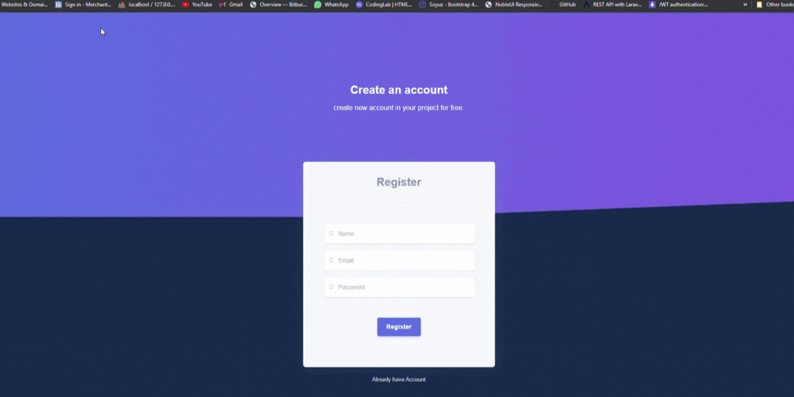

## laravel + Vue js dashboard
mini Project in Laravel and vue js. Real World Laravel 8x + vue js Dashboard.Task management and project management system. Dashboard features such as: Complete Dashboard, Custom Authentication, Email Verification, custom-login-register-forgot password (without jetstream).

## How to use
1. git clone the project using git clone command...
2. Copy `.env.example file to .env`
3. Edit database credentials in .env file
4. Run `composer install`
5. Run `npm install`
6. Run `php artisan key:generate`
7. Run `php artisan migrate`
8. for  `mail` follow this
```
MAIL_MAILER=
MAIL_HOST=
MAIL_PORT=
MAIL_USERNAME=      #Your Email ID #
MAIL_PASSWORD=      #Your Email Password #
MAIL_ENCRYPTION=tls
MAIL_FROM_ADDRESS=  #Your Email ID #
MAIL_FROM_NAME="${APP_NAME}"
```
9. Run `npm run dev`
10. Run `php artisan serve` 
11. `http://localhost:8000/`


You should see the list of Data, something like this:


## Feature
Key Feature of Project.

- Project Management and Task Management System
- Responsive Template use in Vue js
- Front End Vue js
- Custom Authentication System (without jetstream)
- Email Send for Conformation Email
- verify email, reset password email (custom codding)
- Use email Google and Laravel feature
- Register,Login and forgot password without jetstream (custom codding)

`Note`: Please make sure Turn ON `Less secure app access` in your Google account without Email Not Send !.
- Please Following:- `Manage your Google Account => Security => Less secure app access =>Trun ON`

## Register View



## Email Verification View


## Forgot Password View


